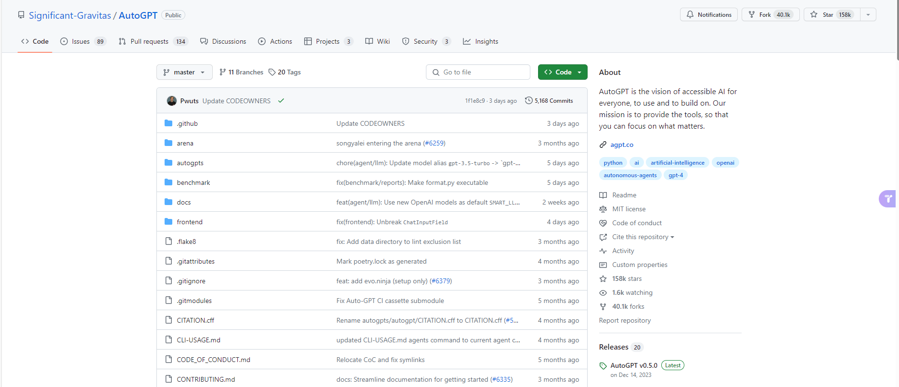
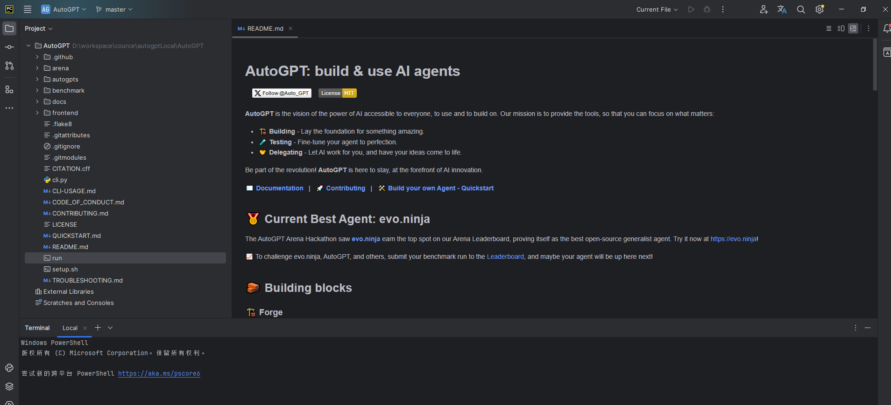
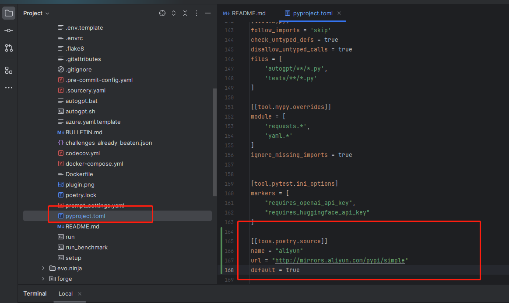
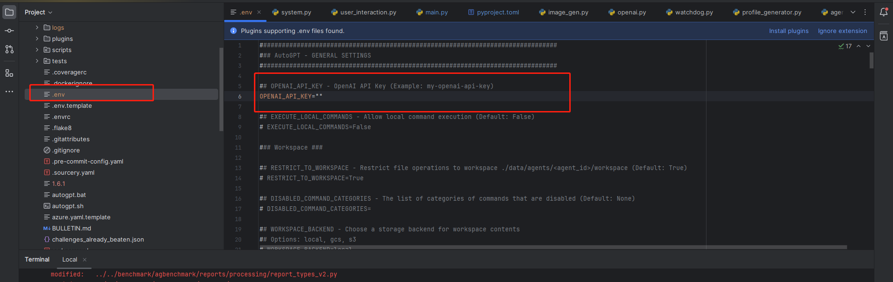
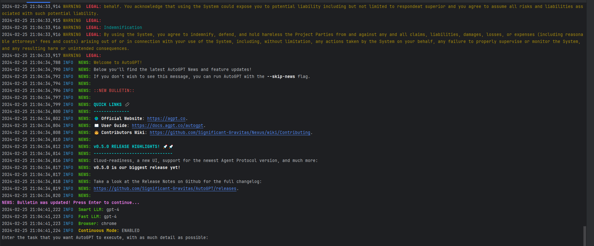

# autogpt 本地部署
autogpt作为最火也是最早的agent项目之一，经过多个版本的迭代，整个项目已经非常厚重了，不仅包括核心的llm-agent逻辑，还加上了诸如:前端界面，后端应用，部署框架，模板等等额外的定制化功能。


**本文档主要讲述如何在本地terminal控制台运行agent，以便能够结合b站的讲解视频，了解autogpt的实现原理。**

## 下载项目

```
git clone https://github.com/Significant-Gravitas/AutoGPT.git
```

## 进入autogpt应用
直接忽略外部工程项目，进入autogpts/autogpt跑local-terminal模式。
> 当然，你也可以按照目前的[官网Documentation](https://docs.agpt.co/)创建自己的app，跑client-server部署模式。

```
cd autogpts\autogpt
```


因为是python工程，需要提前安装python包管理工具[poetry](https://python-poetry.org/docs/#installing-with-the-official-installer)

Windows (Powershell)

```
(Invoke-WebRequest -Uri https://install.python-poetry.org -UseBasicParsing).Content | py -

```

Linux, macOS

```
curl -sSL https://install.python-poetry.org | python3 -
```

> 由于墙内外的原因，这里推荐把poetry源给换了

poetry源文件路径: ``autogpts/autogpt/pyproject.toml``

在文件末尾添加如下代码

```
[[toos.poetry.source]]
name = "aliyun"
url = "http://mirrors.aliyun.com/pypi/simple"
default = true
```


替换好之后就开始安装各种依赖了

```
pip install -i https://mirrors.cloud.tencent.com/pypi/simple/ -e .

```

**替换chatgpt的apikey**

```
cp .env.template .env
```
修改.env文件内容

```
## OPENAI_API_KEY - OpenAI API Key (Example: my-openai-api-key)
OPENAI_API_KEY=YOUR-KEY
```


最后就可以启动cli程序了

```
python -m autogpt run --gpt4only -c
```
如果出现以下控制台画面就说明本地terminal程序启动成功了。

