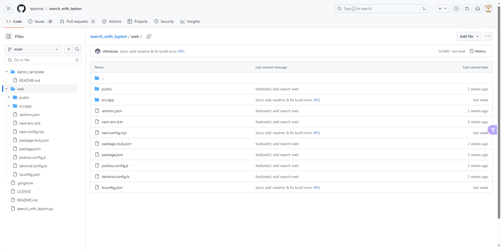
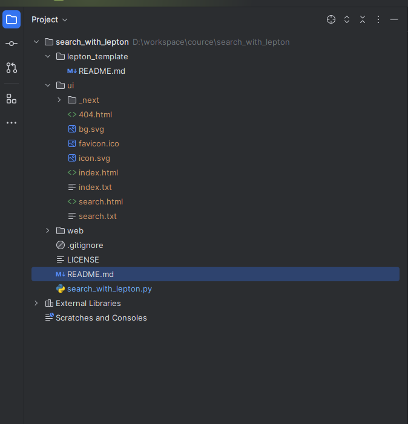
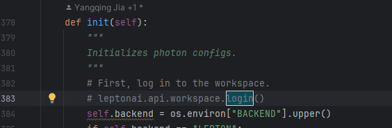
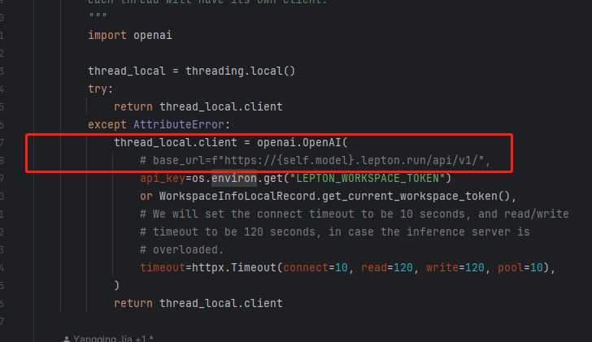
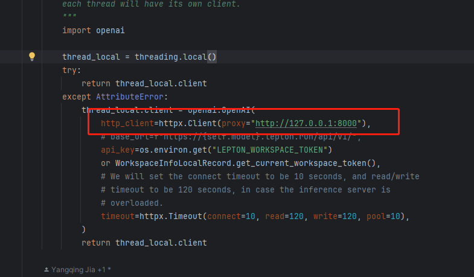
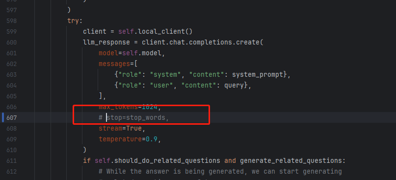
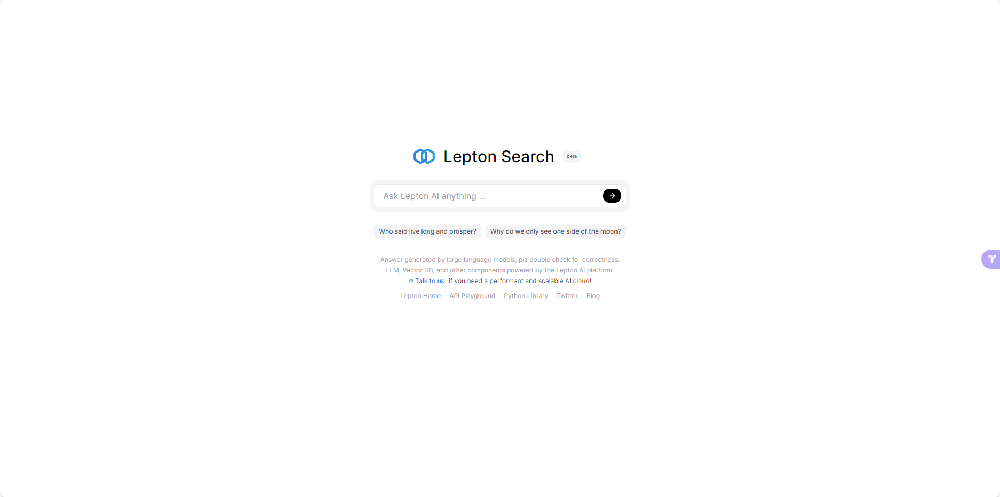

# lepton_ai_search本地部署

首先将工程从GitHub将代码clone下来。https://github.com/leptonai/search_with_lepton


## 工程目录结构
* lepton_template: 里面只有一个项目部署配置相关的markdown说明
* web：这玩意就是一个nextjs做的前端框架，也就是部署之后打开的前端app
* search_with_lepton.py: 核心后端应用，没错就这一个文件，里面包含了
    * leptonai提供的llm应用开发部署脚手架包括不限于
        * 登录鉴权
        * 后端http框架
        * kv存储，存储每次query的result，避免同一个query多次请求大模型消耗计算资源
        * 大模型包装器client，主要是对大模型请求做了统一封装，这样就不用关注底层openai或者mixtral或者llama2等的API差异
    * 搜索引擎接口包括
        * bing
        * google等


### 通过以上的工程结果说明可以看出，要本地部署需要提前安装如下软件：

* nodejs，官网下载即可https://nodejs.org/en，Mac平台直接brew install就行
* 搜索引擎apikey，这里推荐Bing，国内可以在azure云平台申请，没被墙，有免费使用额度。https://portal.azure.com/
* 准备openai的apikey，使用ChatGPT

> 当然，翻墙是必须的；话说回来，你能申请ChatGPT的apikey当然是已经用上VPN了


## 开始本地部署

### 编译前端应用
安装好nodejs后，首先要将前端app，编译成静态资源，这样python-web后端就能直接返回前端HTML静态页面。

```
cd web && npm install && npm run build

```

编译后的目录如下：

多了一个ui文件夹以及相应的前端静态资源文件

### 启动Python工程

> 启动前有几点需要修改，就是代码中使用了lepton-ai这个工具库，既然本地部署了，当然不希望使用了，否则直接体验live-demo就会，当然没有openai账号的也可以去了解以下lepton-ai：https://www.lepton.ai/

#### 安装python依赖

```
pip install requests,fastapi,httpx,loguru,leptonai,openai
```
PS: openai版本最好大于1.0，方便设置代理


#### 修改几处代码

##### 注释search_with_lepton.py第383行



在项目markdown中有这么一行代码
```
pip install -U leptonai && lep login
```
如果你注册了lepton-ai你可以运行lep login，否则就注释掉登录的代码。

##### 注释search_with_lepton.py第383行



因为用的openai，就没必要设置lepton-ai的代理了。理论上本机开了全局代理注释掉就可以了，**如果不行，建议手动设置代理**，如下：


```

thread_local.client = openai.OpenAI(
    # 代理设置
    http_client=httpx.Client(proxy="http://127.0.0.1:8000"),
    # base_url=f"https://{self.model}.lepton.run/api/v1/",
    api_key=os.environ.get("LEPTON_WORKSPACE_TOKEN")
    or WorkspaceInfoLocalRecord.get_current_workspace_token(),
    # We will set the connect timeout to be 10 seconds, and read/write
    # timeout to be 120 seconds, in case the inference server is
    # overloaded.
    timeout=httpx.Timeout(connect=10, read=120, write=120, pool=10),
)

```

##### 注销掉search_with_lepton.py第3607行

注释掉api内的stop字段，因为openai不支持这个字段



##### 添加环境变量

将以下变量添加到系统环境变量当中
* BING_SEARCH_V7_SUBSCRIPTION_KEY,你注册的bing apikey
* LEPTON_WORKSPACE_TOKEN，你的openai apikey
* BACKEND设置为BING，因为这里搜索引擎选择的是BING
* LLM_MODEL，我这里用的是"gpt-4-turbo-preview"这个模型

Mac下
```
export BING_SEARCH_V7_SUBSCRIPTION_KEY="you bing key"
export LEPTON_WORKSPACE_TOKEN="you openai key"
export BACKEND=BING
export LLM_MODEL=gpt-4-turbo-preview
```
Windows Powershell下
```
$env:BING_SEARCH_V7_SUBSCRIPTION_KEY="you bing key"
$env:LEPTON_WORKSPACE_TOKEN="you openai key"
$env:BACKEND="BING"
$env:LLM_MODEL="gpt-4-turbo-preview"
```


### 最后就可以启动应用了

```
python search_with_lepton.py
```

不出意外的话，浏览器输入:http://127.0.0.1:8080/ ,最后结算画面就出来了😃


